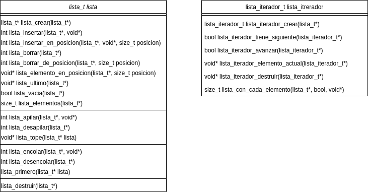

    

    Información
    

    Martina Garibotti.

    Noviembre 2020.

    Universidad de Buenos Aires, Facultad de Ingeniería.

    7541 - Algoritmos y Programación - Curso 4 Mendez.

TDA LISTA
==========

Introducción
------------

En el siguiente trabajo se tiene por objetivo cumplir con el contrato
pedido para recrear la implementación de una biblioteca que permita
hacer uso de listas e iteradores, mediante el uso de la abstracción. En
C, es posible la extensión del lenguaje mediante funciones y
procedimientos, bibliotecas y tipos de datos primitivos.

Marco Teórico
-------------

Un **Tipo de Dato Abstracto**, desde ahora TDA, define una clase de
objetos abstractos los cuales están caracterizados por las operaciones
que pueden realizarse sobre ellos. En otras palabras, no está definido
sólo por una estructura de datos, sino tambień las operaciones que se
definen sobre esa estructura. Cuando se hace uso de un TDA, el interés
se encuentra en el comportamiento que exhive el objeto, en vez de su
implementación. Los TDA deben tender a parecerse a un tipo de dato
primitivo provisto por el lenguaje de programación.

Algunas de las ventajas que tiene la utilizacion de TDAs son:

- **Manejan la abstracción**, permitiendo simplificar el problema
mediante el despojo de complejidad que nos es inherente durante el
estudio.

- **Su encapsulamiento**, se expone la menor cantidad posible de
información de cómo esta implementado y hace que el usuario del TDA se
base en las funciones que él entiende.

- **Fuerza la modularización**, es decir, se localizan los cambios, lo
que permite que se pueda actualizar y mantener, mientras logra una
fácil detección de errores.

### Listas

Las listas son un TDA del cuál derivan otros como pilas, colas, listas
enlazadas, listas doblemente enlazadas y listas circulares. Todos ellos
se caracterizan por ser un conjunto ordenado de elementos.

Es muy común que para su implementación se haga uso de otro TDA, los
**nodos enlazados**. Estos se caracterizan por permitir conocer quien
le sucede o antecede.

Las operaciones que encontraremos en común entre los distintos tipos de
TDA que parten de una lista, son:

- crear (`lista_t* lista_crear()`)

- esta_vacia (`bool lista_vacia(lista_t*)`)

- destruir (`void lista_destruir(lista_t*)`)

### Listas enlazadas

Una lista enlazada está compuesta por nodos que contienen información
del siguiente al cual iterar, pudiendo ser el que le sucede, el que le
antecede o ambos. Otras variantes de listas refieren a su
comportamiento, el cual puede ser linear o circular.

Es una lista enlazada simple, los nodos sólo tienen información del
nodo que les sigue, por lo cuál se dice que son unidireccionales.

En una lista enlazada doble, el nodo guarda información tanto del nodo
anterior como el siguiente, por lo cuál permite con mayor facilidad la
movilidad hacia ambos sentidos de la lista.

- insertar (`int lista_insertar(lista_t*, void*)`)

- insertar_en_posicion  (`int lista_insertar_en_posicion(lista_t*,
void*, size_t)`)

- borrar  (`int lista_borrar(lista_t*)`)

- borrar_de_posicion  (`int lista_borrar_de_posicion(lista_t*, size_t)`)

- elemento_en_posicion  (`void* lista_elemento_en_posicion(lista_t*,
size_t)`)

- ultimo  (`void* lista_ultimo(lista_t*)`)

- elementos  (`int lista_elementos(lista_t*)`)

### Pilas

Una pila es una colección ordenada de elementos en la que al insertarse
o eliminarse elementos, se hace por el mismo extremo, conocido como
tope. Esto quiere decir, que el último elemento añadido, será el
primero en salir.

Un conjunto mínimo de operaciones que debe tener un TDA pila lo
componen:

- apilar (`int lista_apilar(lista_t*, void*)`)

- desapilar (`int lista_desapilar(lista_t*)`)

- tope (`void* lista_tope(lista_t*`)

### Colas

Una cola es una estructura que posee dos extremos por los cuales se
realizan operaciones. Un extremo es el inicio o frente de la cola y el
otro extremo es el final. Los elementos se encolan por el final y se
desencolan por el frente.

Su conjunto mínimo de operaciones lo componen:

- encolar (`int lista_encolar(lista_t*, void*)`)

- desencolar (`int lista_desencolar(lista_t*)`)

- primero (`void* lista_primero(lista_t*)`)

### Iteradores

Los iteradores permiten recorrer secuencialmente los datos almacenados
en el TDA lista sin exponerle al usuario información de cuál es su
estructura.

Estos pueden clasificarse en dos tipos: externos e internos.

#### Iteradores Externos

Es un TDA aparte que permite manejar la iteración de una estructura
mediante sus propias primitivas.

Algunas operaciones que permiten son:

- crear (`lista_iterador_crear(lista_t*)`)

- siguiente (`bool lista_iterador_avanzar(lista_iterador_t*)`)

- hay_mas (`bool lista_iterador_tiene_siguiente(lista_iterador_t*)`)

- elemento_actual (`void*
lista_iterador_elemento_actual(lista_iterador_t*)`)

#### Iteradores Internos

Maneja la iteración dentro de la estructura de datos.

Normalmente es una función que recibe tres parámetros:

- la lista

- un puntero a una función, que recibe un dato, un elemento de la
lista, y otro puntero extra por si la función lo require.

- el puntero extra que funciona como memoria común a todos los nodos
visitados.

Compilación
-----------

En el directorio encontrarás un archivo Makefile que te permitirá una
compilación más sencilla. Se explican las reglas que contiene:

- `make lint`
  - Revisa los archivos .c en el directorio en busca de errores de
sintaxis. Require `cppcheck`

- `make %.o`
  - Compila los archivos .c junto a su cabecera para obtener un
programa objeto. Si ya existía en el directorio, es actualizado.
Requiere `gcc`

- `make minipruebas`
  - Compila y ejecuta las minipruebas recomendadas por la
cátedra, las cuales no son exhaustivas ni suficientes para probar las
implementaciones.

- `make maspruebas`
  - Compila y ejecuta más pruebas.

- `make maspruebas_v`
  - Compila y ejecuta las pruebas bajo el comando
"mostrar_pruebas" para imprimir en pantalla lo que está ocurriendo
detrás de las pruebas.

- `make debug`
  - Se corre el ejecutable junto al debugger.

- `make clean`
  - Elimina los archivos producidos por las reglas del Makefile

Ejecución
---------

En la sección anterior se describieron los comandos definidos para
compilar y ejecutar el programa.

También anteriormente se han mencionado las operaciones de las cuales
dispone el TDA para que sean implementadas por cualquier usuario en el
diseño de su programa.

Sobre la implementación
----------------------

Al publicar un TDA, es recomendable no incluir la estructura del TDA
para que el usuario sólo haga uso de las operaciones diseñadas por el
implementador. De esta forma, si la implementación es buena, se evitan
problemas que surgen al hacer uso del TDA.

Las operaciones deben estar fuertemente testeadas, es decir,
sometidas a distintas pruebas bajo distintos casos, para asegurarle al
usuario que no encontrará fallas en la ejecución del programa, debido
a las implementaciones del TDA.

Algunas menciones para hacer sobre las implementaciones son:

- Se tiene en cuenta que la estructura de los datos puede ser sometida
a cambios en el tiempo, por lo cual se espera que el código esté
modularizado y no se haga uso directo de las estructuras en las
funciones. Por lo tanto, se opta por distintos procedimientos o
funciones para modificarlas.

- Se optó por usar `calloc(1, sizeof(...))` en lugar de
`malloc(sizeof(...))` porque demuestra que los atributos de los struct
se inicializan en 0 o NULL. Esto ahorra la tarea inicializar
manualmente estos valores en el código.

- Las pilas y las colas son tipos especiales de lista, por lo cuál se
aprovechan las funciones de listas para implementar las funciones de
estos tipos. Cuando en una cola se estan encolando elementos, se los
coloca al final, y se los desapilan desde el inicio. Esta idea es
compatible con la estructura de lista que se tiene por lo cuál no es
complicado entender sus implementaciones. Como en la estructura se
tienen la referencia a ambos extremos la complejidad de encolar y
desencolar se encuentran en O(1).

- En las implementaciones de pila, se optó por una idea distinta. Se ha
dicho que el tope es el último elemento apilado, pero tomando las
implementaciones de listas, al apilar se inserta en el inicio. Esto nos
da la ventaja de que el elemento tope, tiene una referencia al elemento
que antes estaba en el tope, por lo cuál, cuando se desapile, el
elemento que tendremos en el tope, será el siguiente del nodo
desapilado. Esto permite mantener la complejidad de apilar y desapilar
en O(1).

- Sobre los iteradores no tengo más comentarios.

- Sobre las pruebas quise hacer uso de la funcion rand() para tomar
posiciones aleatorias y comparar los cambios que se producían cuando
se hacían modificaciones, pero no resultó conveniente porque algunas
veces las pruebas eran exitosas y otras fallaban. Lo recomendable para
esto es aumentar los casos de pruebas y hacerlas más exhaustivas.

En esta tabla pueden verse las funciones y procedimientos de los cuales
el usuario puede hacer uso.

